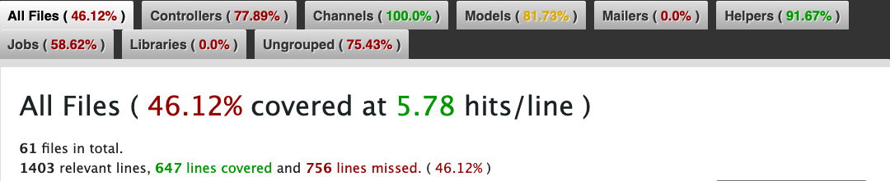

# CUHK Second-Hand Marketplace

A cloud-native SaaS web application for peer-to-peer second-hand trading within the CUHK community, built with Ruby on Rails.

> **Live Demo:** <https://cuhk-marketplace-csci3100-6b82f95ad3ac.herokuapp.com/>

## Table of Contents

- [Tech Stack](#tech-stack)
- [Prerequisites](#prerequisites)
- [Setup Guide](#setup-guide)
- [Running Tests](#running-tests)
- [Implemented Features](#implemented-features)
- [Feature Ownership](#feature-ownership)
- [Test Coverage](#test-coverage)
- [Project Structure](#project-structure)

---

## Tech Stack

| Component       | Technology                        |
| --------------- | --------------------------------- |
| Framework       | Ruby on Rails 7.2                 |
| Language        | Ruby 3.3.8                        |
| Database        | PostgreSQL (with `pg_trgm`)       |
| Real-time       | ActionCable (WebSocket)           |
| Background Jobs | Sidekiq + Redis                   |
| Payments        | Stripe API                        |
| AI              | OpenAI GPT-3.5-turbo              |
| Frontend        | Hotwire (Turbo + Stimulus), TailwindCSS |
| Testing         | RSpec (unit/integration), Cucumber (BDD) |
| CI/CD           | GitHub Actions, Heroku            |

---

## Prerequisites

- **OS:** Linux or macOS (WSL2 Ubuntu 22.04+ on Windows)
- **Ruby:** 3.3.8 (via `rbenv` or `rvm`)
- **Node.js:** v18+ (for asset compilation)
- **PostgreSQL:** 14+
- **Redis:** 6+ (required for Sidekiq background jobs; ActionCable uses async adapter in development)

---

## Setup Guide

### 1. Clone the Repository

```bash
git clone https://github.com/yukariyukaro/CSCI3100.git
cd CSCI3100
```

### 2. Install Dependencies

```bash
# Install system libraries (Ubuntu/Debian)
sudo apt update && sudo apt install -y libpq-dev build-essential

# Install Ruby gems
bundle install
```

### 3. Configure the Database

```bash
# Start PostgreSQL service
sudo service postgresql start

# Create a database superuser (if not yet created)
sudo -u postgres createuser -s $(whoami)

# Create and migrate the database
bin/rails db:prepare
```

### 4. Set Up Environment Variables

Create a `.env` file in the project root (never commit this file):

```bash
# Required for Stripe payment integration
STRIPE_SECRET_KEY=sk_test_...
STRIPE_WEBHOOK_SECRET=whsec_...

# Required for AI summarization
OPENAI_API_KEY=sk-...

# Payment provider: "stripe" or "fake" (default: "fake" for development)
PAYMENT_PROVIDER=fake
```

### 5. Start the Development Server

```bash
# Option A: Rails server only
bin/rails server

# Option B: Rails + TailwindCSS watcher (recommended)
bin/dev
```

Visit `http://localhost:3000` to see the application.

### 6. Start Background Job Processing (Optional)

```bash
bundle exec sidekiq
```

### 7. Load Demo Data (Optional)

```bash
bin/rails demo:reset
```

Demo accounts:
- **Seller:** `demo_seller@example.com` / `password123`
- **Buyer:** `demo_buyer@example.com` / `password123`

---

## Running Tests

### Unit & Integration Tests (RSpec)

```bash
bundle exec rspec
```

### BDD / Acceptance Tests (Cucumber)

```bash
bundle exec cucumber
```

### Code Style (RuboCop)

```bash
bundle exec rubocop
```

### Security Audit

```bash
bundle exec bundle-audit --update
```

### All Checks (as CI runs them)

```bash
bundle exec rubocop && bundle exec rspec && bundle exec cucumber
```

---

## Implemented Features

### Core Features

| # | Feature                     | Description                                                                                          |
|---|-----------------------------|------------------------------------------------------------------------------------------------------|
| 1 | **User Authentication**     | Secure registration and login with `bcrypt`. Session-based auth with login protection on all routes.  |
| 2 | **Product Listing & Management** | Sellers can create, view, and unlist products. Image upload via ActiveStorage (JPEG/PNG, ≤5 MB). |
| 3 | **Product Browsing & Sorting** | Browse all visible products with sorting by price (asc/desc) and time.                            |

### Advanced Features (N−1 Complexity)

| # | Feature                              | Description                                                                                                                                                      |
|---|--------------------------------------|------------------------------------------------------------------------------------------------------------------------------------------------------------------|
| 1 | **Payment Integration (Stripe)**     | Full Stripe Checkout flow with webhook signature verification, idempotent event processing (`PaymentWebhookEvent` + row-level locking), amount reconciliation, and manual intervention for mismatches. Includes a Fake provider for development/testing. |
| 2 | **Real-Time Chat (ActionCable)**     | WebSocket-based live messaging between buyer and seller per product. Conversations are scoped to authorized participants only. Messages are broadcast in real time via ActionCable. |
| 3 | **Fuzzy Search & Autocomplete**      | Full-text search powered by PostgreSQL `pg_search` with `tsvector` and `pg_trgm` (trigram) for typo-tolerant matching. Autocomplete endpoint with server-side caching (5-minute TTL). |
| 4 | **AI Smart Summarization (OpenAI)**  | Automatic product description summarization using OpenAI GPT-3.5-turbo. Triggered on product view, processed asynchronously via `AiSummarizationJob`. Summaries reset when description is edited. |
| 5 | **Automated Background Processing (Sidekiq)** | Sidekiq + Redis infrastructure for async job execution. Includes `AiSummarizationJob` for AI processing and `ListingMaintenanceJob` for auto-archiving listings older than 30 days. |

### Additional Capabilities

| Feature                         | Description                                                                                     |
|---------------------------------|-------------------------------------------------------------------------------------------------|
| **Transaction State Machine**   | Product lifecycle: `active → pending → sold/unlisted`. All state transitions use `with_lock` for concurrency safety. |
| **Theme Toggle (Day/Night)**    | Client-side dark/light mode toggle with persistent preference.                                  |
| **Demo Data System**            | Rake tasks (`demo:reset`, `demo:seed`) for reproducible demo data with avatar/image restoration. |
| **CI/CD Pipeline**              | GitHub Actions: RuboCop linting, `bundle-audit` security scan, RSpec, Cucumber. Auto-deploy to Heroku on merge to `main`. |

---

## Feature Ownership

| Feature                           | Lead           | Assist         |
|-----------------------------------|----------------|----------------|
| Payment & Stripe Integration      | TAN Yihao      | DENG Zhen      |
| Real-Time Chat (ActionCable)      | YANG Longji    |                |
| Fuzzy Search & Autocomplete       | TAN Yihao      |                |
| AI Smart Summarization (OpenAI)   | JIAO Haonan    | LI Peijin      |
| Background Processing (Sidekiq)   | LI Peijin      |                |
| User Auth, Profile, Listings & UI | JIAO Haonan    |                |

### Team Members

| Name         | Student ID  | GitHub Handle                                          |
|--------------|-------------|--------------------------------------------------------|
| YANG Longji  | 1155191588  | [@LifeBeginner-ylj](https://github.com/LifeBeginner-ylj) |
| TAN Yihao    | 1155211107  | [@sty0000](https://github.com/sty0000)                   |
| LI Peijin    | 1155211221  | [@DOR09](https://github.com/DOR09)                       |
| JIAO Haonan  | 1155211226  | [@yukariyukaro](https://github.com/yukariyukaro)         |
| DENG Zhen    | 1155233370  | [@DengZhen21](https://github.com/DengZhen21)             |

---

## Test Coverage

SimpleCov is configured in `spec/rails_helper.rb` and generates an HTML report after each RSpec run.

To generate the coverage report:

```bash
bundle exec rspec
```

After the test suite completes, open `coverage/index.html` in a browser to view the report.

**SimpleCov Report:**



---

## Project Structure

```
app/
├── channels/        # ActionCable channels (ChatChannel)
├── controllers/     # Request handlers (Products, Payments, Conversations, etc.)
├── helpers/         # View helpers
├── javascript/      # Stimulus controllers, Turbo config
├── jobs/            # Background jobs (AiSummarizationJob, ListingMaintenanceJob)
├── mailers/         # (reserved)
├── models/          # ActiveRecord models + concerns (ProductSearch)
├── services/        # Business logic layer
│   ├── ai/          #   AI summarizer (OpenAI integration)
│   ├── payments/    #   Payment providers (Stripe, Fake), webhook processor
│   ├── pricing/     #   (reserved)
│   └── search/      #   (reserved)
└── views/           # ERB templates

config/              # Rails configuration, routes, initializers
db/                  # Schema, migrations, seeds
spec/                # RSpec tests (models, requests, services, system, views)
features/            # Cucumber BDD scenarios
.github/workflows/   # CI (ci.yml) and deployment (deploy.yml)
```

---

## License

This project is developed for CSCI3100 Software Engineering (Spring 2026) at The Chinese University of Hong Kong. All rights reserved.
