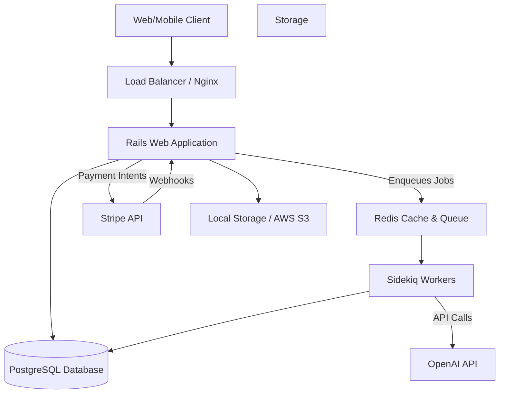
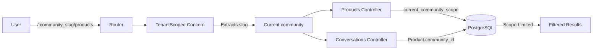

# 系统架构图 (System Architecture)

## 整体架构 (Overall Architecture)

```mermaid
graph TD
    Client[Web/Mobile Client] --> LB[Load Balancer / Nginx]
    LB --> WebApp[Rails Web Application]
    
    subquality[Background Jobs]
    WebApp -->|Enqueues Jobs| Redis[Redis Cache & Queue]
    Redis --> Sidekiq[Sidekiq Workers]
    
    subquality[Data Layer]
    WebApp --> DB[(PostgreSQL Database)]
    Sidekiq --> DB
    
    subquality[External Services]
    Sidekiq -->|API Calls| OpenAI[OpenAI API]
    WebApp -->|Payment Intents| Stripe[Stripe API]
    Stripe -->|Webhooks| WebApp
    
    subquality[Storage]
    WebApp --> Storage[Local Storage / AWS S3]
```

## 多租户架构 (Multi-tenant Architecture)

```mermaid
graph LR
    User --> |/:community_slug/products| Router
    Router --> TenantScoped[TenantScoped Concern]
    
    TenantScoped --> |Extracts slug| Current[Current.community]
    
    Current --> ProductsCtrl[Products Controller]
    Current --> ConversationsCtrl[Conversations Controller]
    
    ProductsCtrl --> |current_community_scope| DB[(PostgreSQL)]
    ConversationsCtrl --> |Product.community_id| DB
    
    DB --> |Scope Limited| Results[Filtered Results]
```
